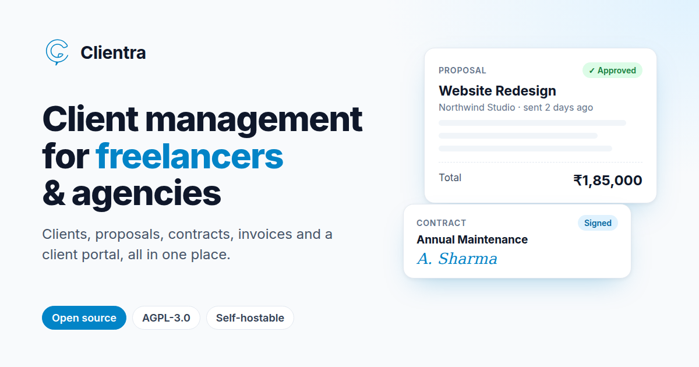

<div align="center">


# Clientra

**Open-source client management for freelancers and agencies.**

Clients, projects, proposals, contracts, invoices and a client portal, in one app you can use hosted or run yourself. A self-hostable, open-source alternative to tools like HoneyBook, Bonsai and Dubsado, built on React and Supabase.

[Website](https://clientra.redmonk.in) · [Self-hosting](#self-hosting) · [Contributing](CONTRIBUTING.md) · [Security](SECURITY.md)

[](https://github.com/redmonkin/core-client-hub/actions/workflows/ci.yml)
[](LICENSE)
[](https://github.com/redmonkin/core-client-hub/stargazers)
[](CONTRIBUTING.md)

</div>



## Features

- **Clients & projects**: contacts, notes, files, tasks and history for every client.
- **Proposals & templates**: reusable rich-text templates, scope and pricing, PDF and Word export.
- **Contracts & e-signatures**: clients sign online. Renewal reminders go out before contracts expire.
- **Invoices & accounts**: recurring invoices and expenses, payments, TDS tracking, and a per-client ledger. Amounts are in ₹.
- **Tasks & timesheets**: track hours per project, import from CSV or Excel and export back.
- **Client portal**: share proposals, contracts and invoices through password-protected links that expire. Clients approve, request changes, sign and comment without creating an account.
- **Team workspace**: invite teammates with roles, including a separate permission for seeing financial figures.
- **Public portfolio**: showcase featured projects, with a "start a project" form that creates leads in your workspace.
- **Notifications**: in-app and email alerts when clients view or respond.

## Tech stack

| Layer | Tools |
| --- | --- |
| Frontend | React 18, TypeScript, Vite, Tailwind CSS, shadcn/ui, TanStack Query, TipTap |
| Backend | [Supabase](https://supabase.com): Postgres with row-level security, Auth, Storage, Edge Functions (Deno) |
| Email | [Resend](https://resend.com) |
| Scheduling | `pg_cron` + `pg_net` for reminders and recurring invoices |

The browser talks to Supabase directly. Row-level security scopes every table to a workspace, and edge functions handle anything that needs the service role: sending email, the token-authenticated client portal, and scheduled jobs.

## Local development

Requirements: Node.js 20+ and a Supabase project (the free tier is fine). The [self-hosting guide](docs/self-hosting.md) explains how to set the project up.

```sh
git clone https://github.com/redmonkin/core-client-hub.git clientra
cd clientra
npm install
cp .env.example .env   # fill in your Supabase URL and anon key
npm run dev            # http://localhost:8080
```

Useful scripts:

| Command | What it does |
| --- | --- |
| `npm run dev` | Start the dev server |
| `npm run build` | Production build into `dist/` |
| `npm run lint` | ESLint |
| `npm run typecheck` | TypeScript checks (Vite's build does not typecheck) |

CI runs lint, typecheck and build on every pull request.

## Self-hosting

Clientra runs on a single [Supabase](https://supabase.com) project, [Resend](https://resend.com) for email, and any static host for the website. **[The self-hosting guide](docs/self-hosting.md)** walks through every step:

1. Create a Supabase project, add two Vault secrets and apply the migrations (`supabase db push`).
2. Verify a sending domain in Resend and create an API key.
3. Set the function secrets (`RESEND_API_KEY`, `EMAIL_FROM_ADDRESS`, `APP_URL`) and deploy the edge functions (`supabase functions deploy`).
4. Configure Supabase Auth: site and redirect URLs, custom SMTP through Resend, and password rules.
5. Build the frontend with the variables from [`.env.example`](.env.example) and deploy it (Vercel works out of the box with `vercel.json`).

It also covers checking that email works, updating to a new version, troubleshooting, and the [third-party services](docs/self-hosting.md#third-party-services) Clientra uses.

## Project structure

```
src/
  pages/            Route components (thin; logic lives in hooks/components)
  components/       Feature components by domain, plus shadcn/ui in ui/
  hooks/            useAuth, useWorkspaceUser (workspace-scoped writes), ...
  lib/              PDF export, portal access tokens, invoice utils, ...
  integrations/     Generated Supabase client and database types
supabase/
  migrations/       SQL migrations, applied in timestamp order
  functions/        Deno edge functions (_shared/ holds common helpers)
docs/               Product requirements, roadmap and feature designs
```

[`CLAUDE.md`](CLAUDE.md) documents the architecture in more depth: the multi-tenant workspace model, token-based portal access and the security conventions every change must follow.

## Contributing

Contributions are welcome. Read [CONTRIBUTING.md](CONTRIBUTING.md) before opening a pull request, and see [docs/ROADMAP.md](docs/ROADMAP.md) for what's planned.

## Security

Please don't report vulnerabilities in public issues. See [SECURITY.md](SECURITY.md).

## License

Clientra is licensed under the [GNU Affero General Public License v3.0](LICENSE). You may use, modify and self-host it freely. If you run a modified version as a service for others, you must make your modified source code available to its users.
